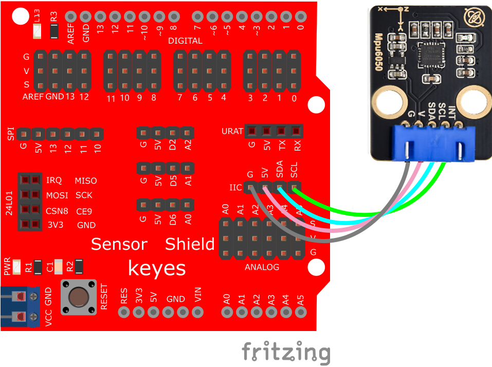

# Arduino


## 1. Arduino简介  

Arduino是一种开源电子原型平台，旨在帮助爱好者和初学者轻松构建各种电子项目。Arduino结合了简单易用的硬件和软件，使得用户能够通过编写代码来控制和互动。基于微控制器的Arduino开发板允许用户连接各种传感器、执行器和显示设备，适用于智能家居、机器人、传感器网络等多个领域。  

Arduino使用简洁明了的编程语言（基于C/C++），不仅适合新手学习编程，也被经验丰富的开发者广泛应用。其强大的社区支持和丰富的文档使得用户能够快速上手，并解决项目中遇到的问题。很多学校和教育机构也将Arduino作为教学的一部分，培养学生的动手能力和创造性思维。  

## 2. 接线图  

  

## 3. 测试代码  

```cpp  
#include "I2Cdev.h"  
#include "MPU6050.h"  

#if I2CDEV_IMPLEMENTATION == I2CDEV_ARDUINO_WIRE  
#include "Wire.h"  
#endif  

MPU6050 accelgyro;  

int16_t ax, ay, az;  
int16_t gx, gy, gz;  
#define LED_PIN 13  
bool blinkState = false;  

void setup() {  
#if I2CDEV_IMPLEMENTATION == I2CDEV_ARDUINO_WIRE  
    Wire.begin();  
#elif I2CDEV_IMPLEMENTATION == I2CDEV_BUILTIN_FASTWIRE  
    Fastwire::setup(400, true);  
#endif  

    Serial.begin(9600);  
    Serial.println("Initializing I2C devices...");  
    accelgyro.initialize();  
    Serial.println("Testing device connections...");  
    Serial.println(accelgyro.testConnection() ? "MPU6050 connection successful" : "MPU6050 connection failed");  
    pinMode(LED_PIN, OUTPUT);  
}  

void loop() {  
    accelgyro.getMotion6(&ax, &ay, &az, &gx, &gy, &gz);  
    Serial.print("a/g:\t");  
    Serial.print(ax); Serial.print("\t");  
    Serial.print(ay); Serial.print("\t");  
    Serial.print(az); Serial.print("\t");  
    Serial.print(gx); Serial.print("\t");  
    Serial.print(gy); Serial.print("\t");  
    Serial.println(gz);  
    blinkState = !blinkState;  
    digitalWrite(LED_PIN, blinkState);  
}  
```  

## 4. 测试结果  

按照接线图连接后，上传代码并上电，我们可以在串口监视器中看到相应的数值，如下图所示：  


