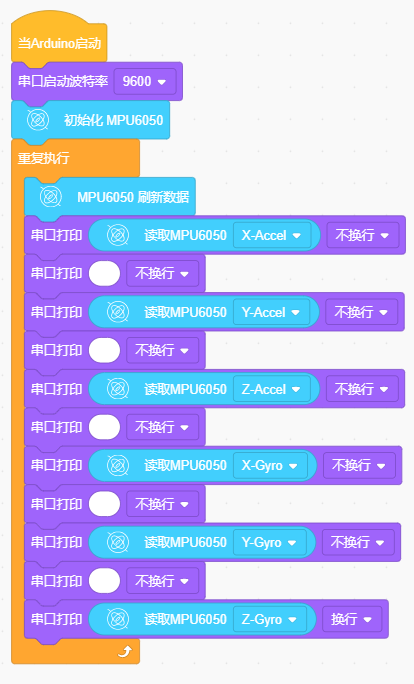

# KidsBlock

## 1. Kidsblock简介  

Kidsblock是一个图形化编程平台，旨在帮助初学者和年轻学生学习编程和电子技术。通过简单易用的拖放式界面，Kidsblock使得用户能够创建互动项目，而无需深入理解复杂的编程语法。它支持多种硬件，包括Arduino等开发板，适合进行各种教育项目和创意实验。  

Kidsblock包含丰富的学习资源，包括模块化编程元素和示例项目，帮助用户轻松上手。这个平台不仅适合儿童，还为新手提供了一个练习编程和动手能力的良好环境。Kidsblock的设计理念强调创造性学习，鼓励学生在互动和实践中掌握技术。  

## 2. 接线图  

  

## 3. 测试代码  

  

## 4. 测试结果  

按照上图接好线，上传代码并上电后，我们可以在串口监视器中看到相应的数值，如下图所示：  

