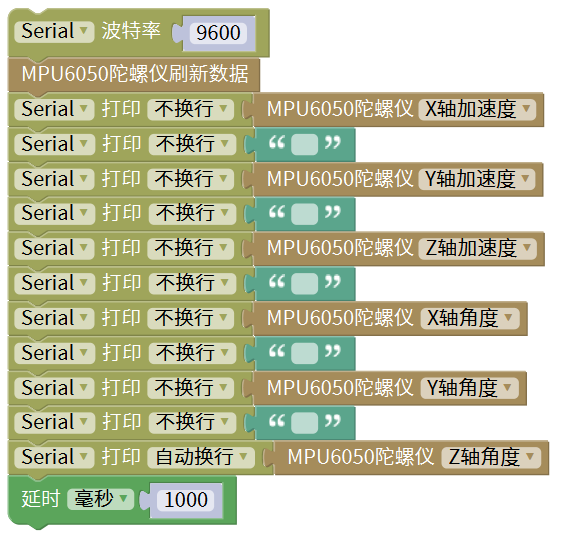
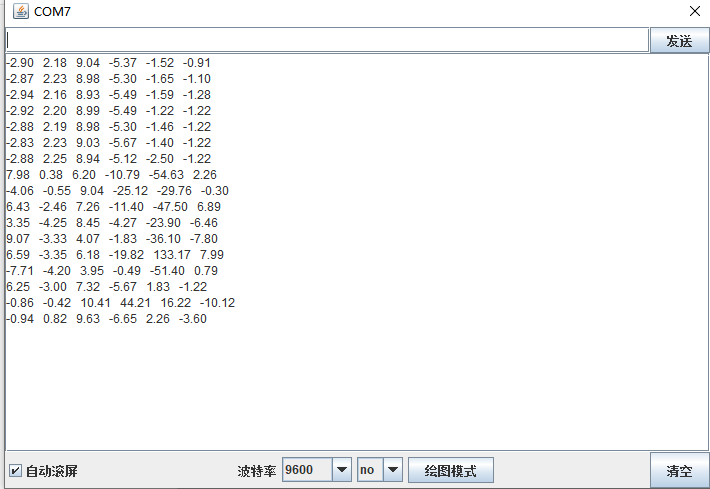

# Mixly

## 1. Mixly简介  

Mixly是一个图形化编程平台，专为 Arduino 和其他生态系统设计，旨在帮助初学者和儿童轻松学习编程概念。通过简单直观的拖放界面，用户可以使用图形化模块进行编程，而无需深入学习复杂的代码语法。Mixly支持 Arduino C 代码生成，使得用户能够在可视化编程和传统编程之间灵活切换。  

Mixly不仅配备了丰富的模块和功能，还有教程和示例项目，能够帮助用户快速上手并进行创造性的项目开发。该平台特别适合教学和学习，并在Arduino社区中得到广泛使用，为用户提供了一个有趣而教育性的编程环境。  

## 2. 接线图  

  

## 3. 测试代码  

  

## 4. 测试结果  

按照上图接好线，上传代码并上电后，我们可以在串口监视器中看到相应的数值，如下图所示：  

