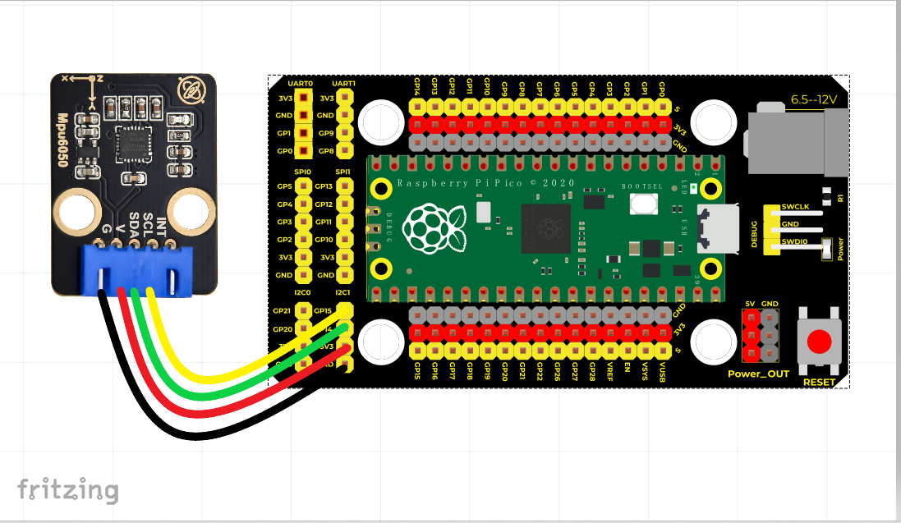
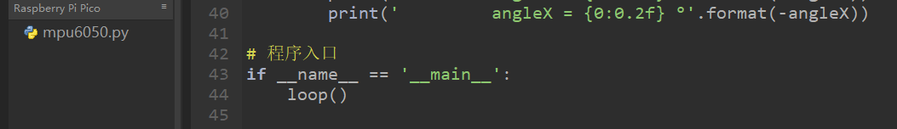
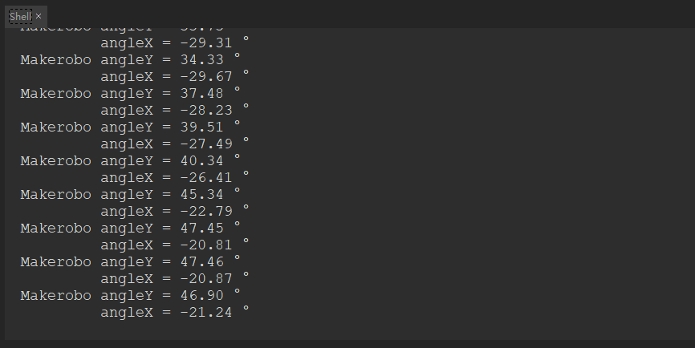

# Python


## 1. Python简介  

Python是一种高层次的编程语言，以其简洁的语法和强大的功能而闻名。它支持多种编程范式，包括面向对象、命令式和函数式编程。Python因其易于学习和使用而成为初学者和专业开发者的热门选择。其丰富的标准库和第三方库使得Python能够广泛应用于数据分析、机器学习、网络开发、自动化脚本、科学计算和人工智能等领域。  

Python的兼容性强，能够在多种平台上运行，提供了一个良好的跨平台开发环境。许多知名的第三方框架（如Django和Flask）和库（如NumPy和Pandas）使得Python在不同领域都有着广泛的应用。其活跃的社区也为学习者提供了丰富的学习资源和支持，使得用户能够轻松解决问题并获取最新的技术动态。  

## 2. 接线图  

  

## 3. 测试代码  

```python  
from machine import Pin  
import utime  
import math  
import mpu6050  

# MPU6050的SDA接GP14,SCL接GP15  
mpu = mpu6050.MPU6050()  
mpu.setSampleRate(200)  # 设置采样率  
mpu.setGResolution(2)    # 设置g分辨率  

# 均值处理  
def averageMPU(count, timing_ms):  
    gx = 0  
    gy = 0  
    gz = 0  
    gxoffset = 0.07  
    gyoffset = -0.04  

    for i in range(count):  
        g = mpu.readData()  
        # offset mpu  
        gx += g.Gx - gxoffset  
        gy += g.Gy - gyoffset  
        gz += g.Gz  
        utime.sleep_ms(timing_ms)  

    return gx/count, gy/count, gz/count  

# 循环函数  
def loop():  
    while True:  
        gx, gy, gz = averageMPU(20, 5)  
        # calculate vector dimension  
        vdim = math.sqrt(gx*gx + gy*gy + gz*gz)  
        # get x angle  
        rad2degree = 180 / math.pi  
        angleX = rad2degree * math.asin(gx / vdim)  
        angleY = rad2degree * math.asin(gy / vdim)  
        # 获取X，Y的倾斜角度  
        print('Makerobo angleY = {0:0.2f} °'.format(-angleY))  
        print(' angleX = {0:0.2f} °'.format(-angleX))  

# 程序入口  
if __name__ == '__main__':  
    loop()  
```  

## 4. 代码说明  

在实验中，我们需要先导入mpu6050模块，导入方法我们之前已经讲过，导入后如下图可看到：  

  

## 5. 测试结果  

按照接线图接好线，上传代码并上电后，我们可以在串口监视器中看到相应的数值，如下图所示：  




